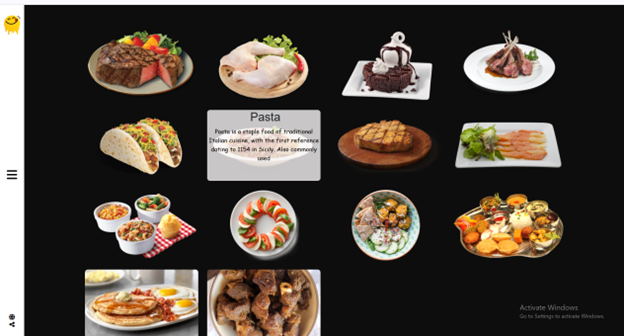
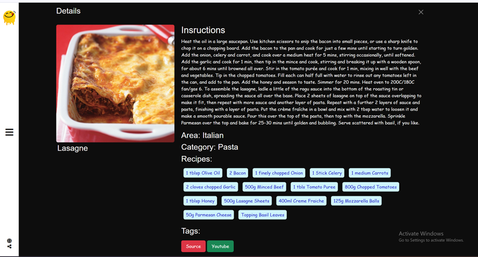
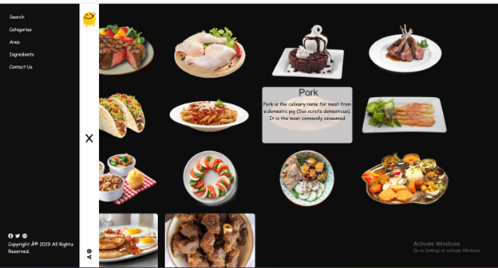

# 🍳 Meals Recipe Finder

A dynamic web app to discover recipes by area, ingredient, or category,with step-by-step instructions and YouTube tutorials.

[](https://mohamed-magdy-dewidar.github.io/Meals/)
[](https://mohamed-magdy-dewidar.github.io/Meals/)
[](https://mohamed-magdy-dewidar.github.io/Meals/)


## 🔗 Live Demo
➡️ [Explore Recipes Now](https://mohamed-magdy-dewidar.github.io/Meals/)

## ✨ Features
- **Advanced Filtering**:
  - Browse by: Area (Italian, Mexican, etc.), Main Ingredient, or Category (Dessert, Vegan, etc.)
- **Recipe Details**:
  - Ingredients list with measurements
  - Step-by-step cooking instructions
  - Embedded YouTube tutorial
- **Responsive Design**:
  - Works on mobile, tablet, and desktop
- **Interactive UI**:
  - Save favorites (local storage)
  - Dark/light mode toggle

## 📸 Screenshots
| Home Page | Recipe Details | Sidebar Filters |
|-----------|---------------|-----------------|
|  |  |  |

## 🛠️ Technologies Used
- **Frontend**:
  
  
  
- **API**: [TheMealDB](https://www.themealdb.com/api.php)
- **Hosting**: GitHub Pages

## 🚀 How to Run Locally
```bash
git clone https://github.com/yourusername/Meals.git
cd Meals
open using Live Server from the Html File